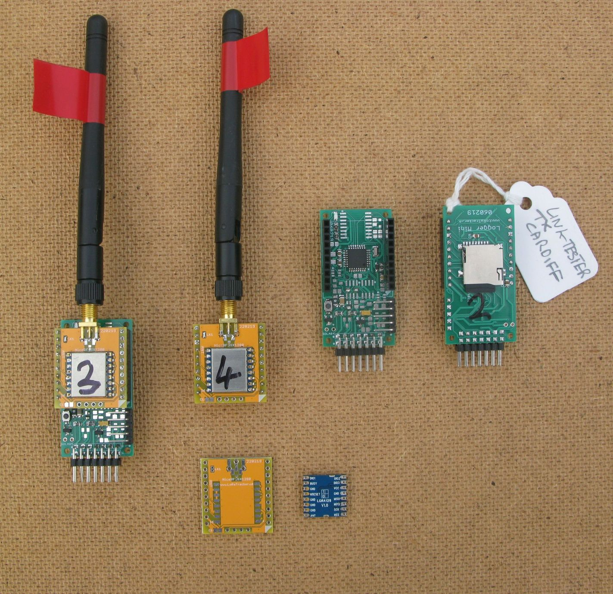
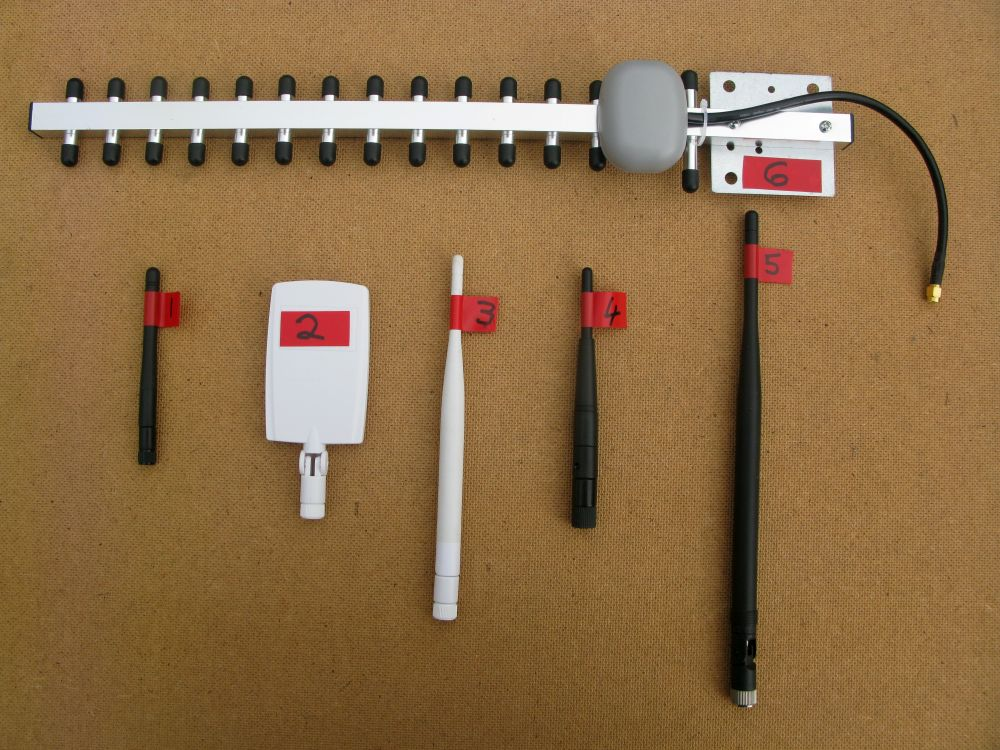

# SX1280 - Semtech 2.4Ghz LoRa Transceivers

### 2.4Ghz Antennas

For the SX1280 we can use readily available and low cost 2.4ghz WiFi antennas.

For long distance testing it will be important to know how effectively the various types of antenna will perform. If the reception distance can be arranged to be a mere 33m then the distance would only need to go to 66m for an antenna with a relative gain of 6dB. This makes testing 2.4ghz antennas practical in a large open area such as a playing field. At the highest LoRa data rate 203kbps the working range at lowest power, -18dBm, is quite short, so the device provides an easy way to test antennas.  

I fitted a NiceRF module and standard short antenna to one of my Mikrobus based Arduinos;

The transmitter was fitted with one of the Ebyte SX1280 modules on the Arduino board shown above. It was programmed to send out a packet about once a second. The receiver was the same board, with a buzzer connected. When it received a packet the buzzer sounded. 

So with the antenna under test fitted to the receiver, I just walked away from the transmitter until the beeps stopped. With the basic antenna (no. 1 in picture) this distance was 82m. See the pictures below of the antennas tested, and then a list of the distances. 

    Antenna   Type          Distance
    
    1         Vertical      82m 
    
    2         Small panel   112m 
    
    3         Vertical      108m 
    
    4         Vertical      95m 
    
    5         Vertical      87m 
    
    6         Yagi          195m 

So no major differences between the verticals and a small benefit with the panel. The exception was the yagi, going more than twice as far as the basic antenna. The yagi was however, highly directional, as expected really. The distances are proportional to the gain.  

The SX1280 provides a very simple and quick way to test WiFi antennas. 

### Stuart Robinson
### GW7HPW
### April 2019